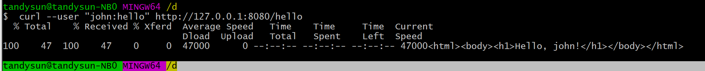
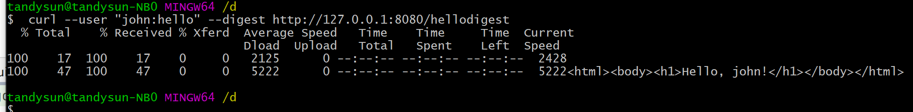

依赖第三方框架，搭建两种类型的服务端。
basic auth
digest auth

运行main_basic.go，启动basic auth 服务。
运行测试命令： 

`curl --user "john:hello" http://127.0.0.1:8080/hello`

运行main_digest.go，启动digest auth 服务。
运行测试命令：

`curl --user "john:hello" --digest http://127.0.0.1:8080/hellodigest`
